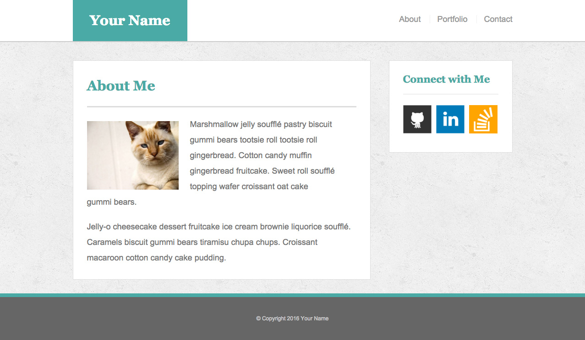
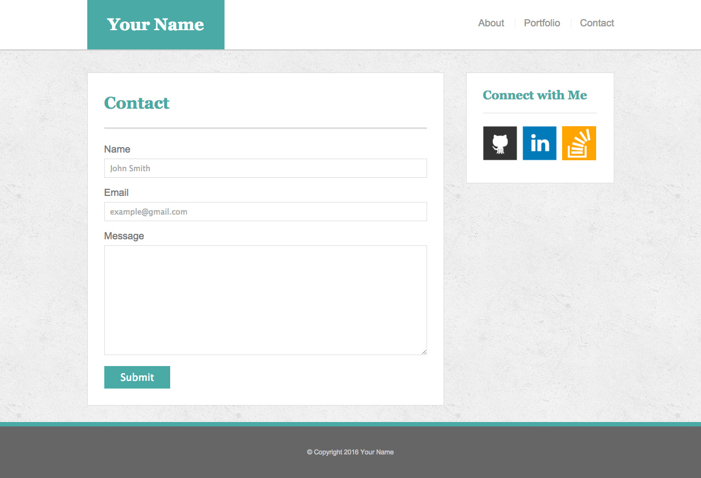
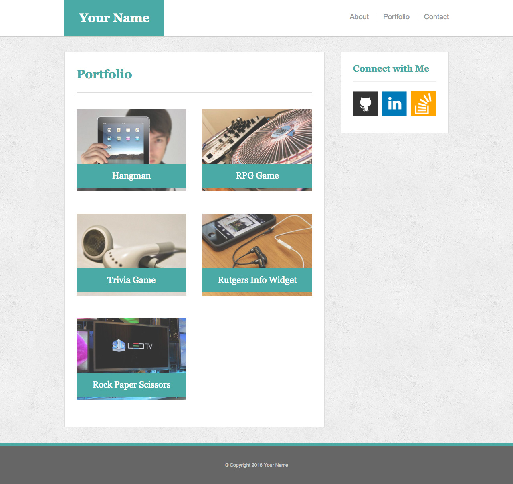

# Week 1 Assignment

## That Portfolio Though...

### Objectives
* Create a professional Portfolio site to start your web development journey!
* Add and manipulate various HTML elements.
* Style various HTML elements with CSS.
* Add and link to other HTML documents.
* Push your code to Github.
* Deploy your code from Github to Heroku.

### Instructions
1. Create a new folder called `Portfolio`.
2. Inside the Portfolio folder, create the following: 
  + Make 3 HTML documents called `index.html`, `contact.html`, and `portfolio.html`
  + Make a folder called `assets`.
    + Inside the assets folder make two additional folders called `css` and `images`.
      + Inside the css folder make a file called `style.css`.
      + Inside the css folder make a file called `reset.css` and include the code found from the Meyerweb reset located [here](http://meyerweb.com/eric/tools/css/reset/reset.css)
      + Inside the images folder you can save the images you plan on using (e.g. your profile image, the placeholder images for the portfolio, and the social icon images).
3. Push up the above changes to Github (Make sure to `git add .` and `git commit -m "initial site files"` then type `git push origin master` to push your changes to your Github repo.
4. Reference the screenshots for the site located here:
    + What you code must exactly match this layout (excluding minor changes like replacing "your name" with your actual name and writing your own unique bio, etc). The design itself must match the screenshots. The specs are located below.
    
    + 

    + 

    + 

5. Begin coding the site one page at a time by writing the html code semantically (meaning if something is a heading, you use a heading tag. If something is a list, you use an unordered or ordered list tag etc.). DO NOT start the CSS styling. CSS comes after your html code is finished. 
  + The content for the `index.html` should be unique to YOU. Write a paragraph or two about yourself. Make it fun, show your personality!
  + The main logo where it says "Your Name" should say your name. This may make the logo section smaller or wider depending on how long your name is, that is fine and expected.
  + Make Git commits often and especially for each page you complete.
6. After all your html is written (Pro-tip: Be sure to [validate your html](https://validator.w3.org/#validate_by_input)) you can begin styling your pages using the `style.css` file you created.
7. Push your changes to Github.
8. Deploy your code to Heroku.

### Specs
1. Colors
  + Teal color (used for headings and backgrounds) = `#4aaaa5`
  + Regular font color (used for paragraphs and all text besides the headings) = `#777777`
  + Main header background color = `#ffffff`
  + Main header border color = `#cccccc`
  + Footer background color = `#666666`
  + Main content background color = `#ffffff`
  + Main content border color = `#dddddd`
  + *Pro-tip: Use the [Eye Dropper](https://chrome.google.com/webstore/detail/eye-dropper/hmdcmlfkchdmnmnmheododdhjedfccka) Chrome extension to find the colors used on web pages.*
2. Fonts
  + Heading fonts use `font-family: 'Georgia', Times, Times New Roman, serif;`
  + All other fonts use `'Arial', 'Helvetica Neue', Helvetica, sans-serif;`
3. Profile image found on `index.html`
  + Use a picture of yourself. If you don't have a picture, you can grab a placeholder image from [LoremPixel](http://lorempixel.com/). Save the images to your `images` folder
4. Portfolio images
  + Placeholder images can be found [LoremPixel](http://lorempixel.com/). Save the images to your `images` folder
5. Social link images (e.g. Github, LinkedIn, and StackOverflow)
  + These images can be found on [IconFinder](https://www.iconfinder.com/). Save the images to your `images` folder
6. Background Images
  + The background pattern used was found on [Subtle Patterns](http://subtlepatterns.com/). You can browse through that site and find whichever pattern you like.
7. Dimensions
  + The width of the entire content area is `960px` wide
  + The width of the main section content is `650px` wide
  + The width of the sidebar is `270px`
  + *Pro-tip. Use the [Page Ruler](https://chrome.google.com/webstore/detail/page-ruler/jlpkojjdgbllmedoapgfodplfhcbnbpn/related?hl=en) extension to measure the size of elements*

#### BONUS
1. Make the pages more sophisticated by adding styling to text links, image links, and buttons when the mouse hovers over them. A CSS hover tutorial can be found [here](http://www.codeitpretty.com/2013/06/how-to-use-css-hover-effects.html). You can use [Adobe Kuler](https://color.adobe.com/create/color-wheel/) to find colors that match the theme (In this case, the primary color is Teal `#4aaaa5`).
2. Make a 'sticky footer'. You will notice the dark grey footer will always rest just below the content. This is fine when the content is long, but if there isn't much content in the body the footer could rest in the middle of the page. Try to code the footer in a way that it will always remain at the bottom of the page, no matter how short the content is. A sticky footer tutorial can be found [here](http://ryanfait.com/html5-sticky-footer/). Please note, I am not talking about positioning the footer as "fixed" to the browser. See screenshots examples:
  + [No sticky footer](bonus_assets/nosticky.jpg)
  + [Has sticky footer](bonus_assets/stickyfooter.jpg)
