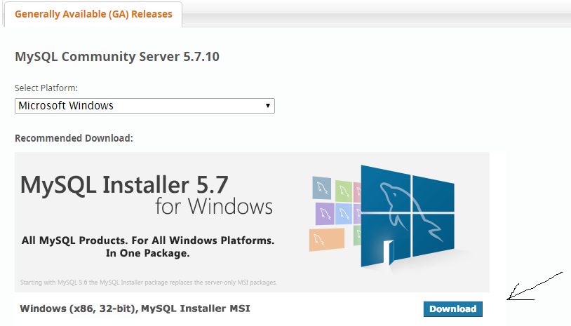

# Installing MySQL for Window/Mac

How to install mySQL

- Make sure you are system admin

### Window installation 

### Part 1:
Go to:
```
https://dev.mysql.com/downloads/mysql/
```
download the lastest version
<!--  -->
[](https://dev.mysql.com/downloads/mysql/)

* Hit the download for the MSI Installer
* It might has you do login or sign up, but just hit the link "No thanks, just start my download."

#### Run the downloaded file as sysAdmin
	* accept the license 
	* select Custom
	* select MySQL Serer 5.7.10 	
	* Type & Networking: set port to 8000
	* create MySQL Root Password (just make sure to save/write down you will need to use it later)
	* leave everything default hit next until Execute button
	* hit Finish

An app will be created in your computer, for me the path to find it is
```
C:\ProgramData\Microsoft\Windows\Start Menu\Programs\MySQL\MySQL Server 5.7
```
### Part 2:
Test if it works

Run `MySQL 5.7 Command Line Client` to start the mySQL server
Enter password: 

if you see `mysql>` and let's you enter commands, great! you are in.

*Extra:
	* Where is your data being stored for MySQL?
	* run this command in the MySQL console `SHOW VARIABLES WHERE Variable_name LIKE '%dir';`
	* The datadir is where MySQL is located

For me it's located at `C:\ProgramData\MySQL\MySQL Server 5.7\Data`

### Mac installation

### Part 1:
Run the following:

`brew update`
`brew doctor`
`brew upgrade`

`brew install mysql`
`mysql.server start`

once started: 
run `mysql -u root –p`

if you see `mysql>` and let's you enter commands, great! you are in.
